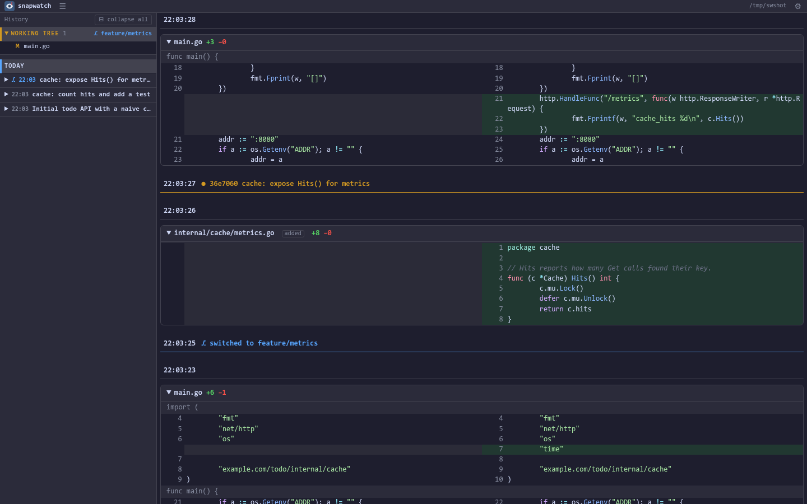
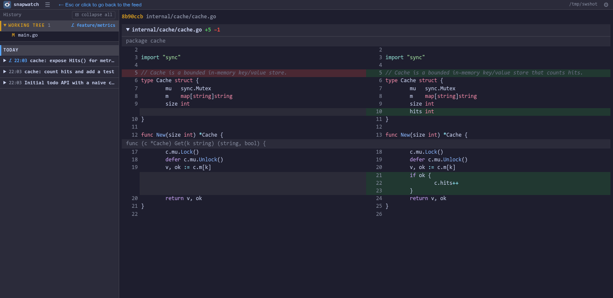
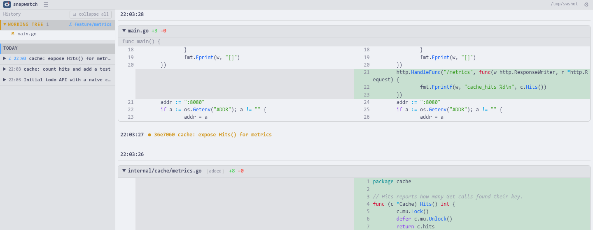

<p align="center">
  
</p>

<h1 align="center">snapwatch</h1>

<p align="center">
  <b>Watch what an AI agent does to your project — live, as diffs, without touching your git repo.</b>
</p>

<p align="center">
  <a href="https://github.com/llehouerou/snapwatch/actions/workflows/ci.yml"></a>
  <a href="go.mod"></a>
  <a href="LICENSE"></a>
  
</p>

`snapwatch` points at a directory, snapshots it into a **shadow git repository**
every time something changes, and shows the resulting diffs in your browser as
they happen. Built for one job: sitting next to Claude Code, Codex, Aider,
Cursor or any other agent and seeing exactly what it just did — file by file,
line by line, in real time, even in projects that aren't under version control.

The project's own `.git` is read for the history sidebar, never written to,
and not required at all.



## Features

- **Live feed** — every save becomes a snapshot; snapshots stream into the
  page over SSE as side-by-side, syntax-highlighted diffs under a sticky
  timestamp. Infinite scroll back through the whole session.
- **Debounced, not spammy** — a burst of writes (an agent editing 12 files,
  a formatter running) becomes one snapshot, not twelve.
- **Git-aware** — if the project is a git repo, its commits show up in the feed
  as `● sha subject` markers and branch switches as `⎇ switched to …`. The
  file churn caused by a checkout is folded away instead of shown as "changes".
- **History sidebar** — the working tree's pending changes, then the project's
  commit log grouped by day, files as a tree. Click a file to see its diff for
  that commit or against `HEAD`; commits that only exist on the current branch
  are marked. Hover a commit for its full message.
- **Zero setup** — one static binary, no config file, no build step, no
  external services. Snapshots live in `$XDG_DATA_HOME/snapwatch/`.
- **Yours to style** — 70+ colour themes (Catppuccin, Dracula, Nord,
  Gruvbox, Tokyo Night, Rosé Pine, GitHub…), any installed font, any size.
  Light themes work too.





## Install

```sh
# Nix (flake): run without installing, or add to your profile
nix run github:llehouerou/snapwatch -- ~/dev/my-project
nix profile install github:llehouerou/snapwatch

# Go
go install github.com/llehouerou/snapwatch@latest

# Prebuilt binary (linux/darwin, amd64/arm64): grab it from the releases page
# https://github.com/llehouerou/snapwatch/releases
```

`git` must be in `PATH` — it's the only runtime dependency.
## Usage

```
snapwatch [--addr 127.0.0.1:7777] [--debounce 300ms] [--open=false] <dir>
```

Point it at the directory your agent is working in and open the URL it
prints (it opens a tab for you unless `--open=false`). That's it.

| Flag | Default | What it does |
|---|---|---|
| `--addr` | `127.0.0.1:7777` | listen address — use a different port per project |
| `--debounce` | `300ms` | quiet time after the last write before a snapshot is taken |
| `--open` | `true` | open the browser at startup (skipped if a tab is already connected) |
| `--version` | | print the version and exit |

### In the browser

| Key / control | Action |
|---|---|
| click a file in the sidebar | show that file's diff (commit or working tree) |
| `Esc` or `← Esc or click…` | back to the feed |
| `h` or `☰` | toggle the history sidebar |
| `⊟ collapse all` | fold every commit in the sidebar |
| `⚙` | theme, font, size |

The URL mirrors what you're looking at (`/?rev=…&path=…`), so a reload or a
pasted link lands on the same file.

### Try it in 20 seconds

```sh
mkdir /tmp/demo && snapwatch /tmp/demo      # terminal 1
echo 'hello' > /tmp/demo/a.txt              # terminal 2 — a snapshot appears
echo 'world' >> /tmp/demo/a.txt             # another one, with the diff
cd /tmp/demo && git init && git add . && git commit -m "first"   # a ● commit marker
```

## How it works

```
your project ─fsnotify─▶ debounce ─▶ git add -A && git commit  (shadow repo, --git-dir elsewhere)
                                          │
                                          ▼
                    browser ◀─SSE─ server ─▶ git log / git diff -M ─▶ go-diff ─▶ side-by-side HTML ─▶ cache
```

- **Shadow repo** — `git --git-dir=$XDG_DATA_HOME/snapwatch/<hash>
  --work-tree=<dir>`. Your project's `.gitignore` is honoured; `.git/`,
  `node_modules/`, `target/`, `.direnv/`, `*.log` are always excluded.
- **Markers** — when the project's own `HEAD` moves between two snapshots,
  the snapshot is committed with a message (`commit <sha> <subject>` or
  `branch <name>`); that's all the feed needs to render it differently.
- **Rendering** — unified diff → [go-diff](https://github.com/sourcegraph/go-diff)
  → paired rows → [chroma](https://github.com/alecthomas/chroma) per line →
  Go templates. Rendered fragments are cached by SHA; the page is
  [htmx](https://htmx.org) + ~80 lines of vanilla JS.
- **Preferences** — one JSON file in `$XDG_CONFIG_HOME/snapwatch/prefs.json`,
  shared by every instance.

## Hacking

```sh
nix develop                                   # go, gopls, git, watchexec
watchexec -r -- go run . ~/dev/some-project   # rebuild on save; the open tab reloads itself
go test ./...
```

Five flat files: `main.go` (flags), `shadow.go` (git), `watch.go` (fsnotify +
debounce), `render.go` (diff → HTML), `server.go` (routes, SSE), plus
`templates/` and `static/`. No frameworks, no build pipeline.

## Non-goals

Restoring a snapshot, pruning history, watching several directories at once,
authentication, a daemon mode, telling agent edits from human edits. It's a
window, not a backup tool.

## License

[MIT](LICENSE)
